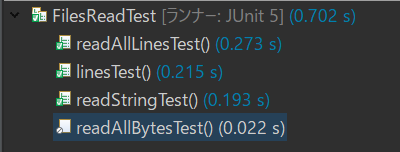
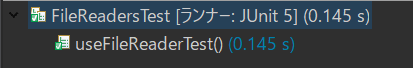
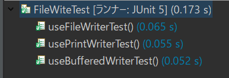
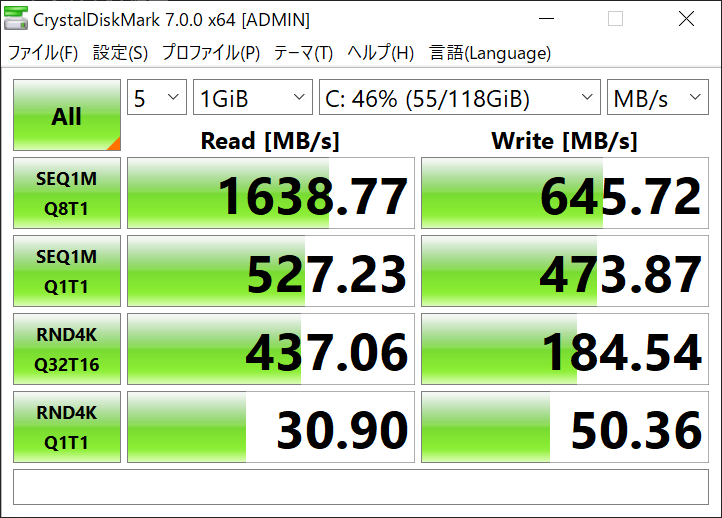

# filelo
## java のファイル操作について
このソースは、javaのファイル操作の試験である。  

### ファイルの読み込みについて
ソースは以下  
* 本体
  * /src/read/FilesRead.java
  * /src/read/FileReaders.java
* テストソース
  * /src/test/read/FilesReadTest.java
  * /src/test/read/FileReadersTest.java
  
テスト実行結果
* FilesReadTest  
    
* FileReadersTest  
  

### ファイルの書き込みについては

ソースは以下
* 本体
  * /src/read/weite/FileWite.java
* テストソース
  * /src/test/write/FileWiteTest.java  

テスト実行結果  
  

### 実行SSD性能
  

### 備考 
本来は、ランダムアクセスやシーケンシャルアクセスについての検証をするべきだが今回はしない  
以下シーケンシャルアクセス及びランダムアクセスの参考ページ  
* [HDDのアクセス手法と転送速度【CrystalDiskMarkを使う】](http://www.pasonisan.com/pc-storage/hdd-02-crystal-time.html)
* [シーケンシャルアクセスとランダムアクセスの操作の違い](https://kb-jp.sandisk.com/app/answers/detail/a_id/8980/~/%E3%82%B7%E3%83%BC%E3%82%B1%E3%83%B3%E3%82%B7%E3%83%A3%E3%83%AB%E3%82%A2%E3%82%AF%E3%82%BB%E3%82%B9%E3%81%A8%E3%83%A9%E3%83%B3%E3%83%80%E3%83%A0%E3%82%A2%E3%82%AF%E3%82%BB%E3%82%B9%E3%81%AE%E6%93%8D%E4%BD%9C%E3%81%AE%E9%81%95%E3%81%84)

## 使用しているファイルについて
青空文庫から数冊ほど
* [心](https://www.aozora.gr.jp/cards/000148/card773.html#download)

## 以下作業中メモ
[メモ](./memo/memo.md)